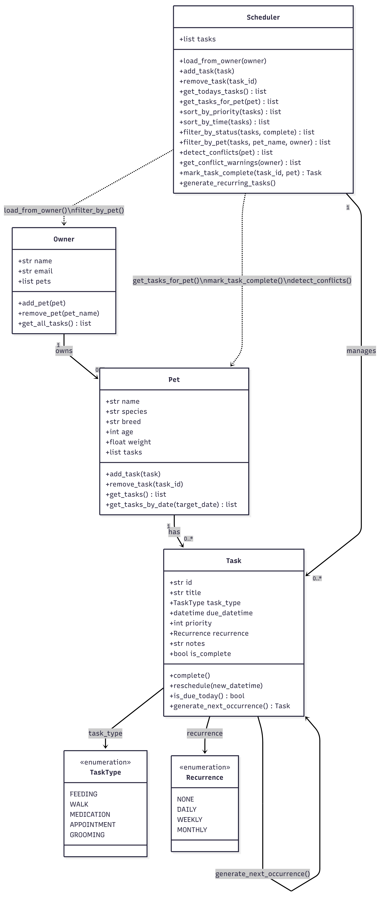

# PawPal+

A Streamlit pet care scheduling app that helps owners plan, track, and manage daily care tasks across multiple pets. Built with a four-class Python backend — `Owner`, `Pet`, `Task`, and `Scheduler` — and a live Streamlit UI that surfaces smart scheduling logic directly to the user.

---

## Features

### Multi-Pet Owner Management
Register an owner profile and attach as many pets as needed. Each pet stores its own task list independently, and the owner aggregates them all through a single `get_all_tasks()` call.

### Task Scheduling with Type, Priority, and Recurrence
Every task carries a task type (`feeding`, `walk`, `medication`, `appointment`, `grooming`), a priority level (1 = highest), and an optional recurrence pattern (`daily`, `weekly`, `monthly`). Due dates are stored as full `datetime` objects so time-of-day ordering works precisely.

### Chronological Sorting
`sort_by_time()` orders any task list by `due_datetime` so the daily view reads like a real agenda. When two tasks share the same time, priority is used as a tiebreaker — the most urgent task appears first.

### Priority Sorting
`sort_by_priority()` returns tasks ordered by urgency regardless of time, useful for deciding what to tackle first when the schedule is tight.

### Flexible Filtering
- `filter_by_status()` — separates done tasks from pending ones without mutating the original list
- `filter_by_pet()` — narrows any task list to a single named pet, cross-referencing task IDs so only that pet's tasks are returned

### Automatic Recurring Task Generation
`mark_task_complete()` does more than flip a flag. When a recurring task is completed, it immediately calculates the next due date using Python's `timedelta` (`daily` = +1 day, `weekly` = +7 days, `monthly` = +1 calendar month) and registers the new task on both the scheduler and the pet — no manual follow-up needed.

### Conflict Detection
`get_conflict_warnings()` scans all incomplete tasks grouped by timestamp using a `defaultdict` and `itertools.combinations` to find every conflicting pair exactly once. Two conflict types are caught:
- **Same-pet conflict** — a pet has two tasks at the exact same time
- **Owner overlap** — two different pets have tasks at the same time, meaning the owner can't attend both

Conflicts are returned as plain warning strings and displayed via `st.warning` in the UI before the daily schedule, so the owner sees them before the day starts.

### Duplicate-Safe Scheduler Loading
`load_from_owner()` pulls tasks from all pets into the scheduler's flat task list and deduplicates by task ID — calling it multiple times in the same session never creates duplicate entries.
## UML

<a href="/course_images/ai110/UML-petcare.png" target="_blank"></a>



##  Demo

<a href="/course_images/ai110/Demo.png" target="_blank"></a>


## Project Structure

```
pawpal_system.py   # Core logic: Owner, Pet, Task, Scheduler, enums
app.py             # Streamlit UI
main.py            # Terminal demo / manual test script
tests/
  test_pawpal.py   # Automated test suite (20 tests)
uml_final.md       # Final Mermaid.js class diagram
```

---

## Smarter Scheduling

Beyond basic task storage, the `Scheduler` class includes several algorithms that make the schedule actually useful:

**Chronological sorting** — `sort_by_time()` orders tasks by `due_datetime` so the daily view reads like a real agenda. When two tasks land at the same time, priority breaks the tie so the more urgent one appears first.

**Flexible filtering** — `filter_by_status()` separates done tasks from pending ones, and `filter_by_pet()` narrows the view to a single pet. Both return new lists so the original data is never mutated.

**Automatic recurring tasks** — `mark_task_complete()` does more than flip a flag. When a recurring task is completed, it immediately generates the next occurrence using Python's `timedelta` (daily = +1 day, weekly = +7 days, monthly = +1 calendar month) and registers it on both the scheduler and the pet — no manual follow-up needed.

**Conflict detection** — `get_conflict_warnings()` scans all incomplete tasks grouped by timestamp and uses `itertools.combinations` to find every conflicting pair. It catches two types: same-pet conflicts (a pet can't be in two places) and owner-overlap conflicts (the owner can't attend two different pets at the same time). Each conflict surfaces as a plain warning string rather than an exception.

---

## Testing PawPal+

### Running the tests

```bash
python -m pytest tests/test_pawpal.py -v
```

### What the tests cover

The suite has 20 tests across four areas:

| Area | Tests | What's verified |
|---|---|---|
| Sorting | 4 | Chronological order, priority tiebreaker, empty-list safety, priority-ascending sort |
| Recurrence | 5 | Daily/weekly next-occurrence dates, non-recurring returns `None`, next task lands on the pet, unknown task ID is handled silently |
| Conflict detection | 5 | No false positives at different times, same-pet clash, cross-pet owner overlap, completed tasks excluded from checks, owner with no pets |
| Filtering & loading | 4 | Status filter, per-pet filter, unknown pet name, duplicate-free loading |

### Confidence level

**4 / 5 stars**

The core scheduling behaviors — sorting, filtering, recurring task generation, and conflict detection — are all covered with both happy-path and edge-case tests, and all 20 pass. The one star held back is for what isn't tested yet: monthly recurrence edge cases (e.g. January 31 → March 1 skip), the Streamlit UI layer, and `generate_recurring_tasks()` as a batch operation. Those would be the next tests to write.

---

## Getting started

### Setup

```bash
python -m venv .venv
source .venv/bin/activate  # Windows: .venv\Scripts\activate
pip install -r requirements.txt
```

### Run the app

```bash
streamlit run app.py
```

### Run the terminal demo

```bash
python main.py
```

---

## System Architecture

The final class diagram (`uml_final.md`) shows the full structure including enums, all methods, and the dependency relationships between `Scheduler`, `Owner`, and `Pet`. Paste the Mermaid code into [mermaid.live](https://mermaid.live) to render it.

**Four core classes:**

| Class | Responsibility |
|---|---|
| `Owner` | Holds owner profile and a list of `Pet` objects |
| `Pet` | Holds pet details and its own task list |
| `Task` | Represents a single care activity with type, time, priority, and recurrence |
| `Scheduler` | The scheduling brain — loads, sorts, filters, detects conflicts, and manages recurrence |

**Two enums:**

| Enum | Values |
|---|---|
| `TaskType` | `feeding`, `walk`, `medication`, `appointment`, `grooming` |
| `Recurrence` | `none`, `daily`, `weekly`, `monthly` |
