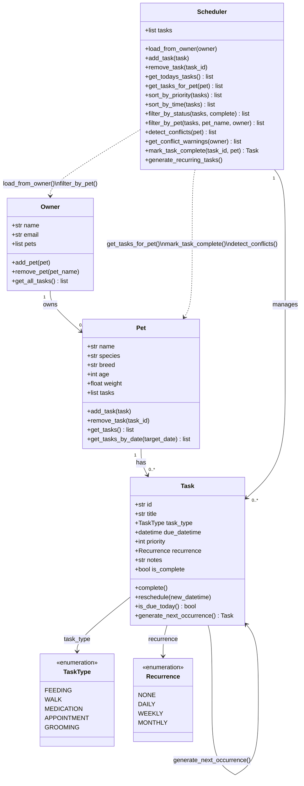

```mermaid
classDiagram
    class TaskType {
        <<enumeration>>
        FEEDING
        WALK
        MEDICATION
        APPOINTMENT
        GROOMING
    }

    class Recurrence {
        <<enumeration>>
        NONE
        DAILY
        WEEKLY
        MONTHLY
    }

    class Task {
        +str id
        +str title
        +TaskType task_type
        +datetime due_datetime
        +int priority
        +Recurrence recurrence
        +str notes
        +bool is_complete
        +complete()
        +reschedule(new_datetime)
        +is_due_today() bool
        +generate_next_occurrence() Task
    }

    class Pet {
        +str name
        +str species
        +str breed
        +int age
        +float weight
        +list tasks
        +add_task(task)
        +remove_task(task_id)
        +get_tasks() list
        +get_tasks_by_date(target_date) list
    }

    class Owner {
        +str name
        +str email
        +list pets
        +add_pet(pet)
        +remove_pet(pet_name)
        +get_all_tasks() list
    }

    class Scheduler {
        +list tasks
        +load_from_owner(owner)
        +add_task(task)
        +remove_task(task_id)
        +get_todays_tasks() list
        +get_tasks_for_pet(pet) list
        +sort_by_priority(tasks) list
        +sort_by_time(tasks) list
        +filter_by_status(tasks, complete) list
        +filter_by_pet(tasks, pet_name, owner) list
        +detect_conflicts(pet) list
        +get_conflict_warnings(owner) list
        +mark_task_complete(task_id, pet) Task
        +generate_recurring_tasks()
    }

    Task --> TaskType : task_type
    Task --> Recurrence : recurrence
    Task --> Task : generate_next_occurrence()

    Owner "1" --> "0..*" Pet : owns
    Pet "1" --> "0..*" Task : has

    Scheduler "1" --> "0..*" Task : manages
    Scheduler ..> Owner : load_from_owner()\nfilter_by_pet()
    Scheduler ..> Pet : get_tasks_for_pet()\nmark_task_complete()\ndetect_conflicts()
```
